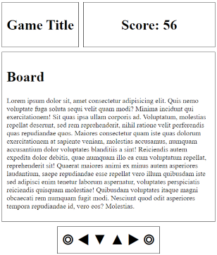

# Les 09 - Layout Responsive

## Oefening 1 - Media Query Drill

Open de map **oefening01**. Merk op dat de index.html slechts 1 p-element bevat met daarin een leeg span-element. De bedoeling van deze oefening is dat de tekst die in de span verschijnt aangepast wordt volgens de grootte van het browserscherm.

- grootte browserscherm < 480px: ... **mobiel** scherm
- grootte browserscherm [480px, 768px[: ... **tablet** scherm
- grootte browserscherm [768px, 1024px[: ...**klein** scherm
- grootte browserscherm [1024px, 1200px[: ...**groot** scherm
- grootte browserscherm >= 1200px: ... **extra groot** scherm

Maak gebruik de **#grootte::before** CSS selector. Deze creëert een nieuw element en je kan de inhoud van dit element instellen door aan de **content** property de gewenste string toe te kennen. In **style.css** zie je hoe dit reeds gebeurt voor de tekst **mobiel**.

Zorg er ook voor dat wanneer het scherm in _landscape modus_ gebruikt wordt de achtergrond van de pagina **orangered** gekleurd is en er **witte** tekst gebruikt wordt; in _portrait modus_ wordt de achtergrond **honeydew** gekleurd.

## Oefening 2 - Media queries & grid lay-out

We werken verder met _oefening07-gamepage_ uit hoofdstuk 07. Je vindt de starter in het _mapje oefening02_. De pagina ziet er als volgt uit:

De bedoeling is dat de lay-out van de pagina aangepast wordt als ze in **portrait** modus wordt bekeken.

Alvorens hiervoor een media query te schrijven gaan we wat voorbereidend werk doen.

- pas de oorspronkelijke grid container aan: maak gebruik van **grid-template-areas** om de verschillende gebieden te benoemen
- maak hiervan nu gebruik om via de **grid-area** property alle grid-items op de juiste manier in de grid te plaatsen
  - je kan de grid-column en grid-row properties verwijderen

Je zult merken dat het aanpassen van de lay-out voor een _portrait scherm_ nu op een uiterst eenvoudige wijze kan gebeuren:

- schrijf een gepaste media query en pas de **grid-template-areas** aan; dit zou moeten volstaan om de lay-out aan te passen

### Extra

Indien de breedte van het scherm onder de 500px daalt in portrait modus dan worden de stats niet langer getoond:

Voeg nog een media query toe zodat de lay-out zich aanpast volgens bovenstaande afbeelding.

## Oefening 3 - Resolution switching & lay-out

In de map **oefening03** vind je een aangepaste versie van de oplossing van de oefening "The nature company" uit les 8.

Voor elke afbeelding zijn nu telkens twee versies (1x en 2x) beschikbaar.

- Vergelijk de resolutie en de grootte van de bestanden
- Maak gebruik van het **srcset**-attribuut om de 2x versie van de afbeeldingen te laden indien de webpagina bekeken wordt op een 2x scherm. Op 1x schermen wordt uiteraard de 1x versie getoond.
- Maak gebruik van de responsive developer tools en laad de pagina in op een 1x en 2x scherm
  - Bekijk het verschil in laaddtijd voor de 1x en 2x afbeeldingen
  - Bekijk wat dit betekent voor iemand die de webpagina bekijkt over een (langzaam) 3G netwerk

De layout van de pagina is momenteel afgestemd op 'mobile'. Stel breakpoints in zodat de lay-out zich als volgt aanpast.

- wanneer de viewport >= 720px
  - zorg dat de div.box2 in de footer getoond wordt
    
- wanneer de viewport >= 1024px
  - zorg dat de div.box3 in de footer getoond wordt
  - stel de flex-basis voor de fotos in op 25% (je ziet nu 3 foto's naast elkaar)
    

## Oefening 4

Open de map **oefening04**.

### Stap 1 - Hero met art direction

Pas **index.html** aan. In het **header** element voeg je, vóór het **h1** element een hero afbeelding toe. Maak hiervoor gebruik van de **svg** bestanden uit de map images en het **picture** element. Toon bij een schermbreedte kleiner dan 700px de afbeelding _world-health-day-narrow_. Bij grotere schermbreedtes wordt dit de afbeelding _world-health-day-wide_. Bekijk het resultaat en zie hoe de afbeelding zich aanpast aan de schermbreedte.

### Stap 2 - Lay-out

De CSS voor deze pagina is afgestemd op mobile. De verschillende atletiek onderdelen staan in een grid met 1 kolom die 100% breed is. Elke cel in de grid bevat een **article** element met twee **div** elementen die onder elkaar getoond worden.

Zorg dat de lay-out zich aanpast, net op het moment dat de hero afbeelding verandert.

Op een breed scherm

- neemt de afbeelding een breedte in van **45%**,
- neemt de tekst een breedte in van **53%**,
- is de overige **2%** ruimte tussen afbeelding en tekst
- is de tekst **vertikaal gecentreerd**
- is de kleur en de grootte van het **h1** element en de kleur van de **randen** aangepast:
  - gebruik kleur _mediumpurple_
  - gebruik font grootte _3.5em_

### Stap 3 - Images

Het is je misschien al opgevallen dat de afbeelding _sprint.jpeg_ belachelijk groot is. Maak gebruik van software (vrije keuze) om de afbeelding te reduceren tot een grootte van exact **1400px breed**. Sla de afbeelding op in **webp formaat**. Zorg dat de afbeelding niet meer dan 320kB in beslag neemt.

## Oefening 5

De firma Vander Beken is ondertussen heel enthousiast over hun website. Sedert hun website online is hebben ze hun omzet zien stijgen met 15%. Mr. Vander Beken heeft beslist om een deel van de winst te investeren in de website en heeft jouw team gevraagd om de website meer responsief en mobile-friendly te maken.

### Stap 1 - Logo

Je merkt dat het logo niet responsive is, het past zich niet aan aan de grootte van het scherm. Bovendien is de kwaliteit niet super als je het logo op grotere schermen bekijkt.

- stel de **max-width** property van **img** elementen in op 100%
  - dit heeft effect op alle **img** elementen op de site, we zullen die straks allemaal bekijken
- zet het logo om naar **svg formaat** (werd reeds gedaan)
  - het logo kan nu _oneindig_ geschaald worden zonder kwaliteitsverlies
  - het logo neemt nog 3kB in beslag (originele was 37kB)
  - het resultaat, _logo-wide.svg_ vind je in de map images;
- pas in het **header** element van elke pagina de verwijzing naar het logo aan

### Stap 2 - Navigatie

- er werd beslist om te kiezen voor een horizontale navigatiebalk onder de header
  - op een smal scherm staan er telkens twee keer twee links naast elkaar
  - op een breder scherm staan alle links naast elkaar

Stel een breakpoint in op **600px** en zorg dat de navigatiebalk correct getoond wordt. Zet 1rem padding boven en onder, en 0.3rem links en rechts, op de **li** elementen zodat de gebruiker van een mobieltje genoeg plaats heeft om makkelijk een link aan te klikken.

### Stap 3 - Contact pagina

Er werd beslist om het _Adres_ en _Contact_ gedeelte bij bredere schermen (>= 600px breed) naast elkaar te tonen.

Ook het contact-formulier wordt aangepast zoals je ziet op volgende afbeelding.

Maak gebruik van technieken die je kent uit de vorige hoofdstukken om deze aanpassingen te realiseren.

### Stap 4 - Realisaties

Er werd beslist om foto's met een aangepaste resolutie te gebruiken. Voor elke realisatie zijn daarvoor 3 versies van de afbeelding gemaakt: **450px breed, 900px breed en 1800px breed**. Je vindt deze afbeeldingen terug in de map images en herkent ze aan de naamgeving: _bestandsnaam-450w.jpg_, _bestandsnaam-900w.jpg_ en _bestandsnaam-1800w.jpg_.

- De afbeelding _winkel.jpeg_ heb je enkel in het origineel formaat. Maak zelf de drie versies met de opgegeven breedtes aan.

Op de pagina _realisaties.html_ moeten de thumbnails nu verwijzen naar de afbeeldingen van 450px breed.

- op een breed scherm (>= 600px) worden de afbeeldingen twee aan twee getoond
- op een smal scherm staan ze allemaal onder elkaar.

Op elke html-pagina in de **map realisaties** moet nu een afbeelding gekozen worden volgens de schermbreedte en de resolutie. Maak hiervoor op deze pagina's gebruik van het **srcset** attribuut met _width descriptors_ voor de 3 versies van de afbeelding. Het **sizes** attribuut mag je eenvoudig instellen op 100vw. Kies de _450w_ versie van de afbeelding als fallback.

### Stap 5 - Over ons

Op deze pagina komt het **aside** element enkel op een breed scherm naast de **section** te staan. Op een smal scherm komt dit er onder.

## Oefening 6 - Hamburger menu

- Open de map **oefening06**.

In onderstaande animated gif wordt de webpagina getoond die je in deze oefening moet maken:

- Stel voor de webpagina:

  - een iets groter standaard lettertype in bijv. 1,2 em
  - stel de **font-family** in op **sans-serif**
  - voorzien wat ademruimte tussen de verschillende regels (regelhoogte 1,5)

- Opmaak nav-element:

  - stel de tekstkleur van het nav-element in op \#cccccc en stel de achtergrondkleur in op #343a40
  - stel de margin van het body-element in op nul, zodat het nav-element
    de volledige breedte van de webpagina kan innemen.
  - Voorzie een beetje witruimte bij het nav-element (14 pixels padding) en bij het main-element (14 pixels padding links en rechts).

- Maak de hyperlinks op in het nav-element:

  - stel de tekstkleur van de hyperlinks in op \#9a9a9a
  - enkel als men hovert over de links mogen deze onderstreept worden, anders niet.
  - de tekstkleur voor de 'active' link is wit en als men de muis beweegt over deze link mag deze niet onderstreept worden.

- Afwerken verticale navigatiebalk:
  - verwijder de 'bullets', margin en padding van het ul-element
  - maak van de hyperlinks block-elementen zodat deze even breed worden als de li-elementen en voorzie een beetje extra witruimte (padding: 3px 16px)

Te bekomen resultaat:

Een uitklapbaar hamburger-menu maakt men meestal met behulp van JavaScript, maar door handig gebruik te maken van de **:checked** pseudo-class kan je ook met alleen CSS een uitklapbaar hamburger-menu maken.

Maak als volgt het hamburger-menu interactief:

- Stel voor de hamburger-afbeelding de muisaanwijzer in op 'pointer'.
- Verberg standaard het menu (ul-element).
- Zorg ervoor dat het menu (ul-element) zichtbaar is als de checkbox aangevinkt is. 
  **Tip** Gebruik de **:checked** pseudo-class op een creatieve manier
- Verberg het selectievakje, want we kunnen door op het label (bevat ook het hamburger-icon) te klikken ook het selectievakje af- en aanvinken, bijgevolg hoeft dit niet zichtbaar te zijn.

In desktop view beperk je de breedte van het main-element tot 640 pixels en centreer je dit element tussen de marges.

Als de layout viewport minimaal 576 pixels is zorg je ervoor dat het hamburger-menu vervangen wordt door een horizontaal menu:

- maak het menu (ul-element) zichtbaar
- plaats de li-elementen naast elkaar en pas de witruimte van de li-elementen aan (padding: 0 7px)
- verberg het label dat het hamburger-icon bevat.
